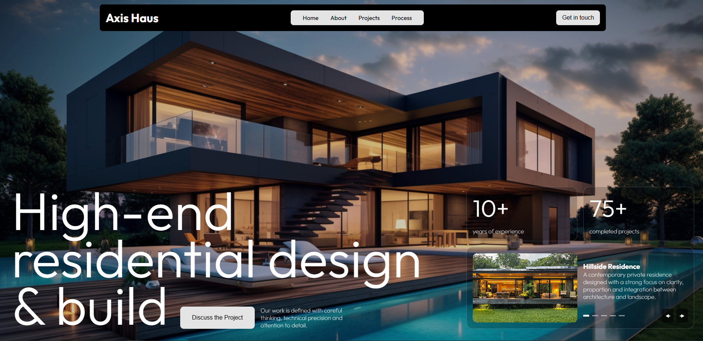

# Architecture-landing-page
A responsive landing page built with Vue.js as a frontend development practice project.

The project focuses on translating a design concept into a fully interactive web experience while exploring modern frontend techniques such as component-based architecture, responsive layouts and scroll-triggered animations.

## Preview

## Features
* Fully responsive design
* Component-based Vue architecture
* Scroll-triggered animations
* Interactive UI transitions
* Mobile-friendly layout
* Modern landing page structure
* Clean and maintainable codebase

## Built With
* Vue.js
* JavaScript
* CSS
* Vite

## Learning Goals
This project was created to improve and demonstrate skills in:
* Vue.js development
* Responsive web design
* Frontend architecture
* Animation implementation
* UI development
* Component reusability

## Credits
The visual design belongs to [Anna Yurieva and Pavel Lozovyi](https://www.behance.net/gallery/246093727/AXIS-HAUS-Visual-Identity-Website?tracking_source=search_projects%7Cwebsite+design&l=18).
House images by [Vecteezy](https://www.vecteezy.com/free-photos/modern-house)
Icon images by [flaticon](https://www.flaticon.com/)
